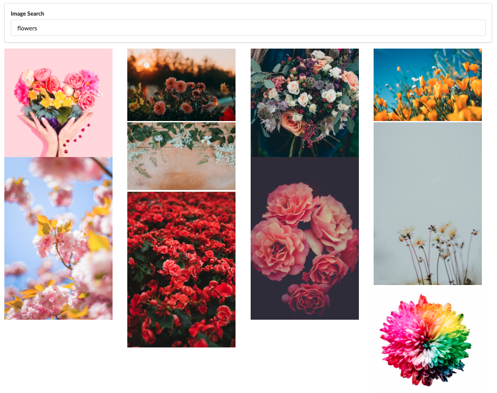

## Search Images in a List View, here's how:

### `npm install`

`npm install axios --save`

### `npm start`

Runs the app in the development mode. 
Open [http://localhost:3000](http://localhost:3000) to view it in the browser.

#### Key Elements

submitting form requests with axios 
binding `this` with arrow function 
.map() function 
React.createRef() function 

